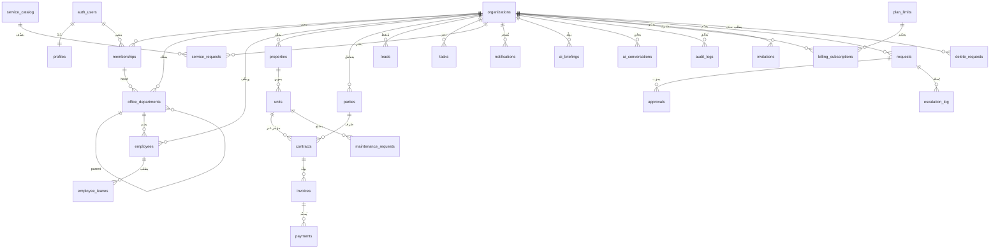

# MULKI OS — ULTIMATE MASTER BLUEPRINT v4.0
## Volume 2 — Core Foundation & Database Architecture
### النواة وقاعدة البيانات: الجذر الذي يحمل كل شيء

| | |
|---|---|
| **الإصدار** | v4.0 — Volume 2 |
| **التاريخ** | 2026-06-17 |
| **التصنيف** | مرجع معماري داخلي — سرّي وخاص بمالك المشروع |
| **النطاق** | المرحلة 1: Master Database & Core Foundation |
| **يعتمد على** | MASTER CONSOLIDATED BLUEPRINT · وثيقة «الشجرة» · الكود الحيّ |
| **يغذّي** | كل المجلّدات اللاحقة (Volumes 3–7) تُبنى فوق هذه النواة |

> **لماذا النواة أولاً؟** لأن «لا شيء يعيش خارج الجذور». كل ورقةٍ يراها المستخدم، وكل وكيل ذكاءٍ يعمل، وكل ريالٍ يُفوتَر — كلّها صفوفٌ في هذه النواة. من يُتقن قاعدة البيانات يملك المنصّة؛ ومن يُخطئ فيها يُعيد بناء كل شيء.

---

## جدول المحتويات

1. [مقدمة المجلّد — ميثاق النواة](#sec-1)
2. [المبادئ الحاكمة لقاعدة البيانات](#sec-2)
3. [معمارية تعدّد المستأجرين (Multi-Tenant)](#sec-3)
4. [مخطّط العلاقات الكامل (ERD)](#sec-4)
5. [قاموس الجداول الكامل (Data Dictionary)](#sec-5)
6. [سياسات أمان مستوى الصف (RLS Policy Catalog)](#sec-6)
7. [نظام التدقيق (Audit System)](#sec-7)
8. [محرّك سير العمل (Workflow Engine)](#sec-8)
9. [الأعمدة المولّدة والمحسوبة (Generated Columns)](#sec-9)
10. [استراتيجية الترحيل وتنظيم الملفات (Migrations)](#sec-10)
11. [مصفوفة حالة التنفيذ (Implementation Status)](#sec-11)
12. [ملحق A — مرجع DDL الكامل](#sec-12)

---

<a name="sec-1"></a>
## 1. مقدمة المجلّد — ميثاق النواة

النواة التقنية لمُلكي هي **قاعدة بيانات PostgreSQL واحدة** تُدار عبر Supabase، تُمثّل «المصدر الواحد للحقيقة» (Single Source of Truth). لا يوجد مصدر بياناتٍ مُوازٍ، ولا حالةٌ تعيش خارجها بشكلٍ دائم.

تتكوّن النواة من ثلاث حلقاتٍ متلاصقة:

1. **نواةٌ فكرية** تُجيب «لماذا»: فصل العمل عن المكان — مكتبٌ كامل بلا جدران.
2. **نواةٌ مبدئية** تُجيب «كيف نحكم القرار»: مبادئ العزل والامتثال والتوسّع بلا انكسار.
3. **نواةٌ تقنية** تحفظ «الحقيقة»: الجداول، العلاقات، الأمان، والأتمتة.

هذا المجلّد يوثّق الحلقة الثالثة توثيقاً تنفيذياً كاملاً، ويربطها بالأولى والثانية في كل قرارٍ تصميمي.

### 1.1 ما الذي يضمنه هذا المجلّد

- **عزلٌ مطلق:** لا ترى منشأةٌ بيانات غيرها — أبداً (org_id + RLS).
- **حقيقةٌ واحدة:** كل رقمٍ في كل لوحةٍ يُحسب من الجداول، لا يُكتب يدوياً.
- **توسّعٌ بلا انكسار:** كل ميزةٍ جديدة تُضاف كصفٍّ أو عمود `metadata` أو جدولٍ مستقل — لا كتعديلٍ يكسر القائم.
- **مسارٌ تدقيقي غير قابل للتعديل:** كل عمليةٍ حسّاسة تُسجَّل ولا تُمحى.
- **أتمتةٌ نازلة:** أصغر حدثٍ في الواجهة يُغذّي كل المؤشّرات تلقائياً («قطرة الماء»).

### 1.2 النطاق الآمن (Regulatory Safe Zone)

> **مبدأ REOS غير القابل للتفاوض:** المنصّة **تُسجّل المعاملات ولا تحوز الأموال أبداً.** جدول `payments` يسجّل واقعة دفعٍ تمّت عبر قناة العميل — لا يُمثّل رصيداً محتجَزاً لدى المنصّة. هذا يُجنّب مُلكي تراخيص وسطاء المدفوعات (SAMA) ويُبقي النطاق ضمن **إدارة أملاك B2B**.

---

<a name="sec-2"></a>
## 2. المبادئ الحاكمة لقاعدة البيانات

كل قرارٍ في هذا المجلّد يخضع لهذه المبادئ السبعة:

| # | المبدأ | التطبيق التقني |
|---|--------|----------------|
| 1 | **تعدّد المستأجرين** (Multi-Tenancy) | كل جدول تشغيلي يحمل `org_id UUID NOT NULL` مع سياسة RLS. |
| 2 | **المصدر الواحد للحقيقة** | لا تكرار للبيانات؛ المشتقّات تُحسب (views / generated columns) لا تُخزَّن مكرّرة. |
| 3 | **قطرة الماء** (الأتمتة النازلة) | الأحداث تُكتب مباشرةً في الجداول، وتُغذّيها triggers ودوال التجميع. |
| 4 | **الورقة التي تزيد** | التوسّع عبر `metadata jsonb` + جداول مرجعية ديناميكية (`service_catalog`) — لا ALTER يكسر. |
| 5 | **الخصوصية المطلقة** | عزل `org_id` + RLS عبر `is_org_member`؛ الحقول الحسّاسة قابلة للتشفير على مستوى التطبيق. |
| 6 | **عدم حيازة الأموال** (REOS) | `payments` و`invoices` تسجيلية؛ لا جدول «رصيد المنصّة». |
| 7 | **الامتثال درعٌ لا قيد** | ضريبة 15% كعمودٍ مولّد (ZATCA)؛ تدقيق غير قابل للتعديل؛ أساس معالجة PDPL. |

### 2.1 قواعد التصميم الموحّدة (Conventions)

- **المفاتيح:** `id UUID PRIMARY KEY DEFAULT gen_random_uuid()` في كل جدول.
- **التواريخ:** `timestamptz` بتوقيت **UTC**؛ التحويل للعرض على مستوى العميل.
- **العزل:** `org_id UUID NOT NULL REFERENCES organizations(id) ON DELETE CASCADE` (عدا `profiles` والجداول العامة).
- **المرونة:** عمود `metadata jsonb NOT NULL DEFAULT '{}'` في الجداول الرئيسية لاستيعاب الحقول المستقبلية.
- **الحذف الناعم:** البيانات الحسّاسة تستخدم `deleted_at timestamptz` بدل DELETE الفعلي (يُطبَّق تدريجياً — انظر §8.4).
- **التسمية:** snake_case إنجليزي للجداول والأعمدة؛ المفاتيح الأجنبية بصيغة `<entity>_id`.
- **الفهارس:** على المفتاح الأساسي، و`org_id`، وكل مفتاح أجنبي، و`created_at` عند الحاجة للترتيب الزمني.

---

<a name="sec-3"></a>
## 3. معمارية تعدّد المستأجرين (Multi-Tenant Architecture)

### 3.1 نموذج العزل

مُلكي تتبع نموذج **«قاعدة بياناتٍ مشتركة، عزلٌ منطقي بالصف»** (Shared Database, Row-Level Isolation):

```
                    ┌──────────────────────────────┐
                    │   PostgreSQL (Supabase)       │
                    │                               │
   Org A ──────►    │  units WHERE org_id = A  ◄── RLS
   Org B ──────►    │  units WHERE org_id = B  ◄── RLS
   Org C ──────►    │  units WHERE org_id = C  ◄── RLS
                    │                               │
                    │  RLS يُطبَّق على مستوى المحرّك  │
                    └──────────────────────────────┘
```

لا تعتمد العزلة على منطق التطبيق وحده — بل على **محرّك قاعدة البيانات نفسه** عبر Row-Level Security. حتى لو أخطأ كودٌ في الواجهة ونسي شرط `org_id`، فإن PostgreSQL يمنع تسرّب البيانات.

### 3.2 دوال الهوية والصلاحية (RLS Helper Functions)

ثلاث دوال `SECURITY DEFINER` تشكّل العمود الفقري للأمان:

```sql
-- المنشآت التي ينتمي إليها المستخدم الحالي
create or replace function current_user_org_ids()
returns setof uuid
language sql stable security definer set search_path = public as $$
  select org_id from memberships where user_id = auth.uid();
$$;

-- هل المستخدم الحالي عضوٌ في منشأةٍ معيّنة؟
create or replace function is_org_member(org uuid)
returns boolean
language sql stable security definer set search_path = public as $$
  select exists (
    select 1 from memberships where org_id = org and user_id = auth.uid()
  );
$$;

-- هل للمستخدم الحالي أحد الأدوار المحدّدة في تلك المنشأة؟
create or replace function has_org_role(org uuid, roles text[])
returns boolean
language sql stable security definer set search_path = public as $$
  select exists (
    select 1 from memberships
    where org_id = org and user_id = auth.uid() and role = any(roles)
  );
$$;
```

**ملاحظات أمنية حرجة:**
- `security definer` يسمح للدالة بقراءة `memberships` متجاوزةً RLS الخاص بها (لتفادي الـ recursion)، لكن `set search_path = public` يمنع هجمات اختطاف المسار.
- `stable` يسمح لمخطّط الاستعلام (planner) بتخزين النتيجة ضمن الاستعلام الواحد — مهمٌّ للأداء.

### 3.3 نموذج الأدوار والصلاحيات

تُخزَّن العضوية في `memberships` بثلاثة محاور:

**أ) الدور (`role`)** — 6 أدوار وصول للمنصّة:

| الدور | الوصف | وصولٌ كامل؟ |
|------|-------|-------------|
| `owner` | المالك | ✅ يتجاوز كل الصلاحيات |
| `manager` | المدير | ✅ يتجاوز كل الصلاحيات |
| `accountant` | المحاسب | حسب الصلاحيات |
| `maintenance_supervisor` | مشرف الصيانة | حسب الصلاحيات |
| `leasing_agent` | وكيل التأجير | حسب الصلاحيات |
| `viewer` | مُطّلِع | قراءة فقط |

> `FULL_ROLES = ['owner', 'manager']` — يتجاوزان فحص الصلاحيات الدقيق.

**ب) الصلاحيات (`permissions jsonb`)** — 12 مفتاحاً دقيقاً:

```
view_financials · approve_payments · manage_tenants · manage_contracts ·
manage_maintenance · manage_providers · manage_units · manage_team ·
view_reports · manage_leads · manage_listings · manage_community
```

**ج) الأقدمية (`seniority`)** — تتحكّم بأدوات المكتب الافتراضي (Volume 3):

```
member  →  head  →  gm  →  owner
```

**خريطة المسار↔الصلاحية (PATH_PERM):** كل مسارٍ في الواجهة يُربط بمفتاح صلاحية، مثال:
`/dashboard/finance → view_financials` · `/dashboard/team → manage_team`.

### 3.4 اعتبارات الأداء (RLS Performance)

- **فهرسة `org_id` إلزامية** على كل جدول تشغيلي — وإلا تحوّلت سياسة RLS إلى مسح كامل للجدول.
- تغليف الدالة في `(select current_user_org_ids())` بدل استدعائها مباشرةً يُمكّن PostgreSQL من تقييمها مرةً واحدة لكل استعلام (InitPlan).
- الجداول العامة (`plan_limits`, `service_catalog`) لا تحمل `org_id` وسياستها قراءةٌ عامة.

---

<a name="sec-4"></a>
## 4. مخطّط العلاقات الكامل (ERD)

### 4.1 نظرة عامة بصرية



### 4.2 المجموعات الستّ (Table Families)

| المجموعة | الجداول | الدور | المرجع في «الشجرة» |
|---------|---------|-------|---------------------|
| **A. الهوية والجذع** | profiles, organizations, memberships, office_departments, employees | من أنت ومن منشأتك وهيكلها | الجذع |
| **B. الأغصان التشغيلية** | properties, units, parties, contracts, invoices, payments, leads, maintenance_requests, tasks, employee_leaves | العمل اليومي | الأغصان |
| **C. السوق البيني** | service_catalog, service_requests | قاعة الخدمات | الطبقة الثانية |
| **D. أوعية التغذية** | notifications, ai_briefings, ai_conversations | الإشعار والذكاء | أوعية التغذية |
| **E. الفوترة والوصول** | billing_subscriptions, plan_limits, invitations | الثمار والدعوات | الثمار |
| **F. التدقيق** | audit_logs | المسار غير القابل للتعديل | الحوكمة |
| **G. محرّك سير العمل** | requests, approvals, escalation_log, delete_requests | الطلبات والموافقات والتصعيد | الحوكمة (يُضاف) |

---

<a name="sec-5"></a>
## 5. قاموس الجداول الكامل (Data Dictionary)

> الحالة: ✅ = منفّذ في `0001_init.sql` · 🔵 = مواصفة جاهزة للتنفيذ (تُضاف في ترحيلٍ لاحق).

### المجموعة A — الهوية والجذع

#### `profiles` ✅
الملف الشخصي لكل مستخدم Supabase Auth.

| العمود | النوع | قيود | الوصف |
|--------|------|------|-------|
| id | uuid | PK → auth.users(id) | معرّف المستخدم |
| full_name | text | | الاسم الكامل |
| phone | text | | الجوال |
| avatar_url | text | | الصورة |
| metadata | jsonb | NOT NULL default '{}' | حقول مرنة |
| created_at | timestamptz | NOT NULL default now() | |

**RLS:** المستخدم يرى/يعدّل ملفه فقط (`id = auth.uid()`).

#### `organizations` ✅
المنشأة — جذر العزل. كل البيانات التشغيلية تتفرّع منها.

| العمود | النوع | قيود | الوصف |
|--------|------|------|-------|
| id | uuid | PK | معرّف المنشأة |
| name | text | NOT NULL | اسم المنشأة |
| slug | text | UNIQUE | المعرّف اللطيف للرابط |
| owner_id | uuid | → auth.users | المالك المؤسّس |
| plan | text | NOT NULL default 'free' | الباقة |
| currency | text | NOT NULL default 'SAR' | عملة العرض |
| country / city | text | | الموقع |
| national_address | text | | العنوان الوطني (السعودية) |
| activity_code | text | | نشاط ISIC4 |
| logo_url | text | | الشعار (White-label) |
| settings | jsonb | NOT NULL default '{}' | إعدادات المنشأة |
| metadata | jsonb | NOT NULL default '{}' | حقول مرنة |
| created_at | timestamptz | NOT NULL default now() | |

**RLS:** الأعضاء فقط (`id IN current_user_org_ids()`)؛ الإنشاء للمالك.

#### `memberships` ✅
عضوية المستخدم في منشأة — يحمل الدور والصلاحيات والأقدمية (انظر §3.3).

| العمود | النوع | قيود |
|--------|------|------|
| id | uuid | PK |
| org_id | uuid | NOT NULL → organizations |
| user_id | uuid | NOT NULL → auth.users |
| role | text | NOT NULL default 'viewer' |
| permissions | jsonb | NOT NULL default '[]' |
| seniority | text | default 'member' |
| invited_by | uuid | → auth.users |
| joined_at | timestamptz | NOT NULL default now() |
| | | UNIQUE(org_id, user_id) |

#### `office_departments` ✅
الهيكل التنظيمي الشجري (إدارة → أقسام فرعية). يولّده محرّك المعرفة من النشاط وعدد الموظفين.

| العمود | النوع | قيود |
|--------|------|------|
| id | uuid | PK |
| org_id | uuid | NOT NULL → organizations |
| dept_key | text | NOT NULL (management, finance, hr...) |
| name | text | NOT NULL |
| parent_id | uuid | → office_departments (self) |
| head_member_id | uuid | → memberships |
| metadata | jsonb | NOT NULL default '{}' |

#### `employees` ✅
الموظف داخل المنشأة، مرتبطٌ بقسمٍ ومستوى أقدمية.

| العمود | النوع | قيود |
|--------|------|------|
| id | uuid | PK |
| org_id | uuid | NOT NULL → organizations |
| user_id | uuid | → auth.users |
| department_id | uuid | → office_departments |
| job_title | text | |
| seniority | text | default 'member' |
| status | text | NOT NULL default 'active' (active/suspended/terminated) |
| metadata | jsonb | NOT NULL default '{}' |

---

### المجموعة B — الأغصان التشغيلية

#### `properties` ✅
العقار. يحوي وحدات.

| العمود | النوع | ملاحظات |
|--------|------|---------|
| id, org_id | uuid | PK / عزل |
| name | text | NOT NULL |
| address, city, country, type | text | |
| metadata, created_at | jsonb / timestamptz | |

#### `units` ✅
الوحدة العقارية (شقة/فيلا/مكتب/محل...).

| العمود | النوع | ملاحظات |
|--------|------|---------|
| id, org_id | uuid | PK / عزل |
| property_id | uuid | → properties |
| unit_number | text | |
| type | text | apartment/room/studio/villa/shop/office/land/warehouse |
| floor | int | |
| area_sqm, rent_amount | numeric | |
| status | text | vacant/occupied/maintenance |
| metadata, created_at | | |

#### `parties` ✅
الطرف الخارجي (مستأجر/مالك) — نموذجٌ موحّد مع `portal_access` للبوابات.

| العمود | النوع | ملاحظات |
|--------|------|---------|
| id, org_id | uuid | PK / عزل |
| name | text | NOT NULL |
| type | text | tenant/owner |
| phone, email, id_number | text | (قابلة للتشفير) |
| portal_access | boolean | default false |

#### `contracts` ✅
عقد إيجار/بيع يربط وحدةً بمستأجرٍ ومالك.

| العمود | النوع | ملاحظات |
|--------|------|---------|
| id, org_id | uuid | |
| unit_id | uuid | → units |
| tenant_id, owner_id | uuid | → parties |
| start_date, end_date | date | |
| amount | numeric | |
| status | text | draft/active/expired/terminated |

#### `invoices` ✅
الفاتورة — تحتسب الضريبة تلقائياً (عمود مولّد).

| العمود | النوع | ملاحظات |
|--------|------|---------|
| id, org_id | uuid | |
| contract_id | uuid | → contracts |
| amount | numeric | NOT NULL default 0 |
| **vat** | numeric | **GENERATED ALWAYS AS (amount * 0.15) STORED** |
| due_date, paid_date | date | |
| status | text | pending/paid/overdue/cancelled |
| type | text | rent... |

#### `payments` ✅ (REOS — تسجيلي لا حيازي)
| العمود | النوع | ملاحظات |
|--------|------|---------|
| id, org_id | uuid | |
| invoice_id | uuid | → invoices |
| amount | numeric | |
| method, provider, reference | text | provider: stripe/moyasar/tap/hyperpay |
| paid_at | timestamptz | |

#### `leads` ✅
العميل المحتمل (بنطاق جغرافي محمي — انظر §6).

#### `maintenance_requests` ✅
طلب الصيانة — مستوى الموافقة عمودٌ مولّد (انظر §9).

| العمود | النوع | ملاحظات |
|--------|------|---------|
| id, org_id, unit_id | uuid | |
| category, description | text | |
| amount_estimate | numeric | default 0 |
| **approval_level** | text | **GENERATED** (auto ≤500 / manager ≤2000 / owner >2000) |
| status | text | open... |
| requested_by, assigned_to | uuid | |

#### `tasks` ✅
المهمة (مرتبطة بموظفٍ وقسم). تُغذّي مؤشّر «المهام المكتملة/المتأخرة».

#### `employee_leaves` ✅
طلب إجازة موظف (pending/approved/rejected) — يتكامل مع محرّك سير العمل (§8).

---

### المجموعة C — السوق البيني

#### `service_catalog` ✅ (جدول عام)
كتالوج الخدمات الذي يتوسّع ديناميكياً — أوّل تطبيقٍ لمبدأ «الورقة التي تزيد».

| العمود | النوع | ملاحظات |
|--------|------|---------|
| id | uuid | PK |
| key | text | UNIQUE |
| name, category | text | |
| active | boolean | default true |

**RLS:** قراءة عامة للمسجّلين.

#### `service_requests` ✅
طلب خدمةٍ في السوق البيني، موجّهٌ جغرافياً بخمسة مستويات (دولة→منطقة→مدينة→حي→نوع).

| العمود | النوع | ملاحظات |
|--------|------|---------|
| id, org_id | uuid | |
| service_key | text | → service_catalog.key |
| title, description | text | |
| country, region, city, district | text | التوجيه الجغرافي |
| budget | numeric | |
| status | text | open... |

---

### المجموعة D — أوعية التغذية

#### `notifications` ✅
| الأعمدة | id, org_id, user_id, title, body, level(info/warning/critical), read, metadata |
|---|---|

#### `ai_briefings` ✅
ملخّصات «نور» الذكية. `data` يحوي المؤشّرات، و`narrative` النصّ المولّد بالـ AI.

| الأعمدة | id, org_id, user_id, period(daily/weekly), data jsonb, narrative text |
|---|---|

#### `ai_conversations` ✅
محادثات وكلاء الذكاء. `messages jsonb` سجلّ المحادثة، `agent` الوكيل (noor/cfo/hr...).

---

### المجموعة E — الفوترة والوصول

#### `billing_subscriptions` ✅
اشتراك المنشأة. الفوترة = الأعلى بين الاستخدام الفعلي وحدّ الباقة (المنطق في التطبيق + `plan_limits`).

| الأعمدة | id, org_id, tier, status, provider, provider_subscription_id, current_period_start/end, metadata |
|---|---|

#### `plan_limits` ✅ (جدول عام)
حدود الباقات والأسعار والحصص.

| العمود | النوع | ملاحظات |
|--------|------|---------|
| tier | text | PK (free/growth/professional/business/enterprise) |
| price_sar | numeric | 0/50/150/300/500 |
| unit_quota | jsonb | حصص مجانية لكل نوع وحدة |
| features | jsonb | قائمة المزايا |

#### `invitations` ✅
دعوات الفريق (كود `STF-xxxxx`).

| الأعمدة | id, org_id, email, role, code(UNIQUE), status, invited_by |
|---|---|

---

### المجموعة F — التدقيق

#### `audit_logs` ✅ (+ trigger للحماية — §7)
| العمود | النوع |
|--------|------|
| id, org_id, user_id | uuid |
| action | text NOT NULL |
| table_name, record_id | text/uuid |
| old_values, new_values | jsonb |
| ip_address, user_agent | text |
| created_at | timestamptz |

---

### المجموعة G — محرّك سير العمل (🔵 يُضاف في `0003_workflow.sql`)

#### `requests` 🔵 — إطار الطلبات الموحّد
يوحّد كل أنواع الطلبات (مالية/موارد بشرية/عقود/تشغيلية) تحت سجلٍّ واحد.

| العمود | النوع | ملاحظات |
|--------|------|---------|
| id, org_id | uuid | |
| request_type | text | finance/hr/contract/operational/strategic |
| title, description | text | |
| requestor_id | uuid | → auth.users |
| department_id | uuid | → office_departments |
| priority | text | low/normal/high/urgent |
| status | text | draft/submitted/under_review/approved/rejected/escalated |
| required_approvers | uuid[] | سلسلة المعتمدين |
| current_approver_id | uuid | المعتمد الحالي |
| amount | numeric | إن كان مالياً |
| attachments | jsonb | |
| created_at, resolved_at | timestamptz | |

#### `approvals` 🔵
| الأعمدة | id, request_id, approver_id, decision(approve/reject), notes, decided_at |
|---|---|

#### `escalation_log` 🔵
| الأعمدة | id, request_id, from_approver_id, to_approver_id, reason, escalated_at |
|---|---|

#### `delete_requests` 🔵 — الحذف الآمن متعدّد الموافقة
| الأعمدة | id, org_id, requestor_id, table_name, record_id, reason, status, approved_by, created_at |
|---|---|

---

<a name="sec-6"></a>
## 6. سياسات أمان مستوى الصف (RLS Policy Catalog)

### 6.1 النمط العام (Org-Isolation)

كل جدولٍ تشغيلي يُطبّق هذا النمط (مُولَّد آلياً في `0001_init.sql` عبر حلقة `DO $$`):

```sql
alter table <table> enable row level security;

create policy <table>_org_isolation on <table>
  for all
  using      (org_id in (select current_user_org_ids()))
  with check (org_id in (select current_user_org_ids()));
```

### 6.2 الحالات الخاصة

```sql
-- profiles: المستخدم وملفه فقط
create policy profiles_self on profiles
  for all using (id = auth.uid()) with check (id = auth.uid());

-- organizations: العضو يرى منشأته؛ الإنشاء للمالك
create policy organizations_org_isolation on organizations
  for all
  using      (id in (select current_user_org_ids()))
  with check (owner_id = auth.uid() or id in (select current_user_org_ids()));

-- الجداول العامة: قراءة فقط
create policy catalog_read on service_catalog for select using (auth.role() = 'authenticated');
create policy limits_read   on plan_limits    for select using (true);
```

### 6.3 طبقة الصلاحيات الدقيقة (فوق RLS)

RLS يضمن **العزل بين المنشآت**. أما **الصلاحيات داخل المنشأة** (من يرى المالية؟ من يعتمد الدفع؟) فتُطبَّق على طبقتين:

1. **الواجهة:** إخفاء/تعطيل العناصر عبر `usePermissions()` و`PATH_PERM`.
2. **الخادم (مستقبلاً):** سياسات RLS أدقّ تستخدم `has_org_role()` للعمليات الحسّاسة، مثال:

```sql
-- مثال: لا يعدّل المالية إلا من يملك الدور المناسب
create policy invoices_write on invoices
  for insert with check (
    has_org_role(org_id, array['owner','manager','accountant'])
  );
```

> **مبدأ:** RLS = جدارٌ بين المنشآت (إلزامي). الصلاحيات = أبوابٌ داخل المنشأة (تدريجي حسب الحساسية).

### 6.4 النطاق الجغرافي للعملاء المحتملين (Geographic RLS)

`leads` تتطلّب حمايةً إضافية تمنع «سرقة العملاء» بين المنشآت المتنافسة: لا ترى المنشأة إلا العملاء ضمن مناطق تغطيتها. يُطبَّق ذلك مستقبلاً عبر ربط `leads.city` بجدول تغطيةٍ (يُفصَّل في Volume 5).

---

<a name="sec-7"></a>
## 7. نظام التدقيق (Audit System)

### 7.1 المبدأ — سجلٌّ غير قابل للتعديل

`audit_logs` هو العمود الفقري للحوكمة والامتثال (SOCPA/PDPL). **لا يُعدَّل ولا يُحذَف أبداً** — فقط يُضاف إليه (append-only).

### 7.2 محفّز منع التعديل (Immutability Trigger) 🔵

```sql
create or replace function prevent_audit_modification()
returns trigger language plpgsql as $$
begin
  raise exception 'سجل التدقيق غير قابل للتعديل أو الحذف (immutable audit log)';
end;
$$;

create trigger trg_audit_immutable
  before update or delete on audit_logs
  for each row execute function prevent_audit_modification();
```

### 7.3 محفّز التدقيق العام (Generic Audit Trigger) 🔵

يُسجّل تلقائياً أي تغييرٍ على الجداول الحسّاسة:

```sql
create or replace function fn_audit()
returns trigger language plpgsql security definer set search_path = public as $$
declare v_org uuid;
begin
  v_org := coalesce(new.org_id, old.org_id);
  insert into audit_logs(org_id, user_id, action, table_name, record_id, old_values, new_values)
  values (
    v_org, auth.uid(), tg_op, tg_table_name,
    coalesce(new.id, old.id),
    case when tg_op in ('UPDATE','DELETE') then to_jsonb(old) end,
    case when tg_op in ('INSERT','UPDATE') then to_jsonb(new) end
  );
  return coalesce(new, old);
end;
$$;

-- يُربط بالجداول الحسّاسة (مثال):
-- create trigger trg_audit_invoices after insert or update or delete
--   on invoices for each row execute function fn_audit();
```

### 7.4 ماذا نُدقّق؟

| الفئة | الجداول | السبب |
|------|---------|-------|
| مالية | invoices, payments, contracts | امتثال محاسبي |
| صلاحيات | memberships, employees | أمان |
| موافقات | approvals, delete_requests | حوكمة |
| إعدادات حسّاسة | organizations.settings, billing_subscriptions | تتبّع التغيير |

---

<a name="sec-8"></a>
## 8. محرّك سير العمل (Workflow Engine)

### 8.1 الفلسفة

كل قرارٍ في مُلكي يمرّ بمسارٍ واضح: **طلب → تصنيف → توجيه → موافقة/رفض → تنفيذ → تدقيق.** المحرّك يوحّد هذا المسار عبر `requests` و`approvals` و`escalation_log`.

### 8.2 مصفوفة الصلاحيات المالية (Authority Matrix)

| المستوى | حدّ الاعتماد (افتراضي، قابل للتهيئة) |
|---------|--------------------------------------|
| member | 0 – 200 ر.س |
| head | 0 – 1,000 ر.س |
| manager | 0 – 10,000 ر.س |
| gm | 0 – 50,000 ر.س |
| owner | غير محدود |

### 8.3 سير عمل موافقة الصيانة (State Machine)

يعتمد على العمود المولّد `approval_level`:

```
تقديم الطلب → تصنيف المبلغ تلقائياً (approval_level):
  ≤ 500 ر.س     → auto      → اعتماد تلقائي → إشعار المزوّد
  501–2000 ر.س  → manager   → طابور المدير → موافقة/رفض → إشعار المزوّد
  > 2000 ر.س    → owner     → طابور المالك → موافقة/رفض → إشعار المدير
```

```
[open] ──submit──► [pending_approval] ──approve──► [approved] ──assign──► [in_progress]
                          │                                                     │
                          └──reject──► [rejected]              [in_progress] ──proof──► [completed]
```

### 8.4 سير عمل الحذف الآمن (Safe Delete)

بدل DELETE المباشر للبيانات الحسّاسة:

```
طلب حذف (delete_requests) → مراجعة المالك/المدير →
  موافقة → تنفيذ الحذف (أو deleted_at) + تسجيل في audit_logs
  رفض   → إغلاق الطلب، البيانات محفوظة
```

### 8.5 إطار الطلبات الموحّد والتصعيد

```
requests.status:
  draft → submitted → under_review → (approved | rejected | escalated)

محفّزات التصعيد (escalation_log):
  - تجاوز مهلة الاعتماد        → تصعيد لأعلى الهرم
  - المبلغ يتجاوز صلاحية المعتمد → تصعيد للمستوى الأعلى
  - تضارب مصالح                → معتمدٌ محايد
  - ركود الطلب (N أيام)        → تصعيد + تنبيه

مسار التصعيد: member → head → manager → gm → owner
```

### 8.6 أنواع الموافقة المدعومة

- **مفرد** (Single) — معتمدٌ واحد.
- **متسلسل** (Sequential) — A → B → C.
- **متوازٍ** (Parallel) — A و B معاً.
- **تصويت أغلبية** (Majority) — كنموذج تصويت اتحاد الملاك.

---

<a name="sec-9"></a>
## 9. الأعمدة المولّدة والمحسوبة (Generated Columns)

| الجدول.العمود | التعريف | الفائدة |
|---------------|---------|---------|
| `invoices.vat` | `GENERATED ALWAYS AS (amount * 0.15) STORED` | ضريبة ZATCA تلقائية، لا تُكتب يدوياً أبداً |
| `maintenance_requests.approval_level` | `GENERATED ... CASE amount_estimate ≤500/≤2000/else` | توجيه الموافقة بلا منطق تطبيقي |
| `service_providers.composite_score` 🔵 | `quality*0.35 + price*0.20 + reliability*0.25 + speed*0.20` | تقييم مركّب (Volume 5) |

> **القاعدة:** أي قيمةٍ قابلة للاشتقاق من قيمٍ أخرى **تُحسب** (generated/view) ولا تُخزَّن مكرّرة — تطبيقاً لمبدأ المصدر الواحد للحقيقة.

---

<a name="sec-10"></a>
## 10. استراتيجية الترحيل وتنظيم الملفات (Migrations)

### 10.1 ترتيب التشغيل

```
supabase/migrations/
├── 0001_init.sql        ✅  النواة: 24 جدولاً + دوال RLS + السياسات + الفهارس
├── 0002_seed.sql        ✅  بيانات أولية: plan_limits + service_catalog
├── 0003_workflow.sql    🔵  requests + approvals + escalation_log + delete_requests
├── 0004_audit.sql       🔵  prevent_audit_modification + fn_audit + ربط المحفّزات
└── 0005_permissions.sql 🔵  سياسات الصلاحيات الدقيقة (has_org_role) للجداول المالية
```

### 10.2 مبادئ الترحيل

- **idempotent:** استخدام `create table if not exists` و`drop policy if exists`.
- **append-only للمخطّط:** لا تُعدّل ترحيلاتٍ منشورة؛ أضِف ترحيلاً جديداً.
- **التوسّع عبر `metadata`:** الحقول الجديدة غير الحرجة تذهب إلى `metadata jsonb` قبل أن تستحق عموداً مستقلاً.

### 10.3 التطبيق

```bash
# عبر Supabase CLI
supabase db push
# أو لصق محتوى كل ملف بالترتيب في SQL Editor
```

---

<a name="sec-11"></a>
## 11. مصفوفة حالة التنفيذ (Implementation Status)

| العنصر | الحالة | الموقع |
|--------|--------|--------|
| 24 جدولاً أساسياً | ✅ | `0001_init.sql` |
| دوال RLS الثلاث | ✅ | `0001_init.sql` |
| سياسات العزل (org-isolation) | ✅ | `0001_init.sql` |
| الأعمدة المولّدة (vat, approval_level) | ✅ | `0001_init.sql` |
| الفهارس الأساسية | ✅ | `0001_init.sql` |
| بيانات plan_limits + service_catalog | ✅ | `0002_seed.sql` |
| محرّك سير العمل (requests/approvals/escalation/delete) | 🔵 | `0003_workflow.sql` (مخطّط) |
| محفّزات التدقيق (immutability + generic) | 🔵 | `0004_audit.sql` (مخطّط) |
| سياسات الصلاحيات الدقيقة | 🔵 | `0005_permissions.sql` (مخطّط) |
| النطاق الجغرافي لـ leads | 🔵 | Volume 5 |
| تقييم المزوّدين (composite_score) | 🔵 | Volume 5 |

---

<a name="sec-12"></a>
## 12. ملحق A — مرجع DDL الكامل

> الـ DDL التنفيذي الكامل للنواة موجودٌ فعلاً ومُختبَر في:
> - **`supabase/migrations/0001_init.sql`** (النواة + RLS + الفهارس)
> - **`supabase/migrations/0002_seed.sql`** (البيانات الأولية)
>
> هذا المجلّد (Volume 2) هو **المرجع الوصفي** لذلك الـ DDL؛ وأي تعديلٍ على المخطّط يجب أن يُحدَّث هنا وفي الترحيل معاً (مبدأ المصدر الواحد للحقيقة).

### خلاصة الجداول (24 + 4 موسّعة)

```
الهوية والجذع (5):   profiles · organizations · memberships · office_departments · employees
الأغصان (10):        properties · units · parties · contracts · invoices · payments ·
                     leads · maintenance_requests · tasks · employee_leaves
السوق البيني (2):    service_catalog · service_requests
أوعية التغذية (3):   notifications · ai_briefings · ai_conversations
الفوترة والوصول (3): billing_subscriptions · plan_limits · invitations
التدقيق (1):         audit_logs
─────────────────────────────────────────────────────────────
محرّك سير العمل (4) 🔵: requests · approvals · escalation_log · delete_requests
```

---

## خاتمة Volume 2

النواة جاهزة: مخطّطٌ معزولٌ بالكامل، آمنٌ على مستوى الصف، يحتسب المشتقّات تلقائياً، ويُسجّل كل عمليةٍ حسّاسة بلا إمكان تعديل. **كل ما يأتي بعده — المكتب الافتراضي، قوة العمل الذكية، السوق، المدينة الرقمية — يُبنى فوق هذه الجداول الـ28، ولا يخرج عنها.**

> **التالي:** `Volume 3 — Virtual Office OS` — كيف تتحوّل هذه الجداول إلى مكتبٍ افتراضي حيّ يراه المالك والموظف والزائر.

---
*نهاية Volume 2 — Core Foundation & Database Architecture*
*MULKI OS — ULTIMATE MASTER BLUEPRINT v4.0*
