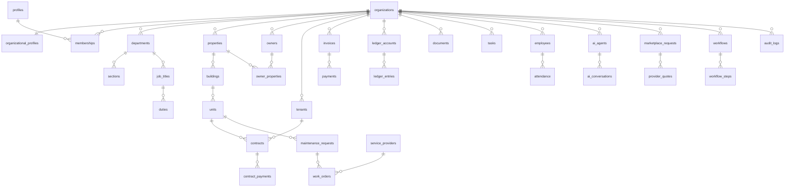

# 02 — CORE FOUNDATION & DATABASE ARCHITECTURE
## النسخة الموسّعة (Expanded Blueprint)

| | |
|---|---|
| **الإصدار** | v4.0 — Volume 2 (Expanded) |
| **الحالة** | ✅ مرجع تنفيذي تفصيلي |
| **الطبيعة** | المعمارية **المستهدَفة** (Target) — مع خريطة لما هو **منفّذ حالياً** |

> **ملاحظة:** يصف هذا المجلّد المعمارية المثالية المستهدَفة. التطبيق الحيّ (`mulki-reos`) يحقّق جزءاً كبيراً منها بأسماء مبسّطة — انظر §0.3.

---

## المحتويات
- [0. المبادئ والمنهج](#p0)
- [أ — النواة والعزل (1–2)](#pa)
- [ب — الهوية والهيكل (3–6)](#pb)
- [ج — العقارات والأطراف (7–9)](#pc)
- [د — العقود والمالية (10–12,19)](#pd)
- [هـ — الصيانة والخدمات (13–15)](#pe)
- [و — المستندات والمهام والموارد البشرية (16–18)](#pf)
- [ز — الذكاء والسوق والإشعارات (20–22)](#pg)
- [ح — التدقيق وسير العمل والأمن (23–25)](#ph)
- [ط — مصفوفة الصلاحيات (150+)](#pi)
- [ي — ERD الموحّد](#pj)

---

<a name="p0"></a>
## 0. المبادئ والمنهج

### 0.1 الحقيقة الواحدة
لا تُخزَّن المعلومة في أكثر من مكان. ❌ اسم العقار داخل العقد · ✅ العقد يرتبط بالعقار عبر `unit_id → units → buildings → properties`.

### 0.2 قواعد التصميم
- `id UUID PK DEFAULT gen_random_uuid()` · `org_id UUID NOT NULL` على كل جدول تشغيلي.
- `timestamptz` بـUTC · `metadata jsonb DEFAULT '{}'` · حذف ناعم `deleted_at`.
- snake_case · المفاتيح الأجنبية `<entity>_id`.

### 0.3 خريطة المستهدَف ↔ المنفّذ

| المستهدَف | المنفّذ حالياً في `mulki-reos` | الحالة |
|---|---|---|
| organizations + organizational_profiles | `organizations` (موحّد) | 🔵 |
| properties → buildings → units | `properties` → `units` | 🟠 buildings تُضاف |
| owners / tenants | `parties` (موحّد بـtype) | 🔵 مكافئ |
| departments→sections→job_titles→duties | `org_departments`+`org_sections`+`dept_members` | 🟠 جزئي |
| permissions+role_permissions (150+) | `dept_permissions_ref`+`memberships.permissions[]` | 🟠 يُوسَّع |
| ledger_accounts+ledger_entries | `ledger_entries`,`payments`,`invoices` | 🟠 |
| workflows+workflow_steps | `approvals`,`delete_requests` | 🟠 يُعمَّم |
| ai_agents/conversations/memory | موجودة ✅ | ✅ |
| audit_logs | `audit_log` ✅ (+v_arrears مُؤمّن) | ✅ |

---

<a name="pa"></a>
# أ — النواة والعزل

## الفصل 1 — معمارية النواة
كل عملية تمرّ عبر النواة. سلاسل الترابط (مفتاح أجنبي واحد، لا تكرار):
```
Organization → Department → Section → JobTitle → Duty
Property → Building → Unit → Contract → Invoice → Payment
```

## الفصل 2 — Multi-Tenant Architecture
آلاف المنشآت في قاعدة واحدة بعزل تام. كل جدول يحمل `org_id` وسياسة RLS موحّدة:
```sql
create policy t_isolation on <t> for all
  using (org_id in (select org_id from memberships where user_id = auth.uid()))
  with check (org_id in (select org_id from memberships where user_id = auth.uid()));
```
دوال: `current_user_org_ids()` · `is_org_member(org)` · `has_org_role(org,roles[])` — `security definer, search_path=public`.

---

<a name="pb"></a>
# ب — الهوية والهيكل

## الفصل 3 — المنشآت
```sql
organizations(id, name, slug unique, email, phone, country, city, status, metadata jsonb, created_at)
organizational_profiles(id, org_id→organizations, industry, activity_code, employee_count,
  virtual_office_enabled, ai_enabled, marketplace_enabled)
```
علاقة 1:1. `status ∈ {active,suspended,closed}`. تعطيل المنشأة يخفي بياناتها دون حذف.

## الفصل 4 — المستخدمون
```sql
profiles(id→auth.users, full_name, email, phone, avatar, language, timezone, national_id, info_confirmed)
memberships(id, org_id→organizations, user_id→profiles, role, department_id→departments,
  job_title_id→job_titles, permissions text[], unique(org_id,user_id))
```
**قاعدة حرجة:** `memberships.user_id` يلزمه `profiles` موجود (FK) — يُنشأ تلقائياً عبر trigger عند التسجيل. الأدوار الستة؛ owner/manager يتجاوزان الصلاحيات.

## الفصل 5 — الهيكل التنظيمي
```sql
departments(id, org_id, name, parent_department_id→departments, head_membership_id)
sections(id, department_id→departments, name)
job_titles(id, department_id→departments, title, grade)
duties(id, job_title_id→job_titles, title, description)
```
Department ذاتي المرجع (هرمي). يُولَّد تلقائياً من النشاط+عدد الموظفين (Mintzberg/RACI).

## الفصل 6 — محرك الصلاحيات
```sql
permissions(id, key unique, name, category)
role_permissions(role_id→roles, permission_id→permissions)
```
الهدف 150+ صلاحية. طبقتان: RLS (عزل) + صلاحيات (أبواب داخلية). كل مسار↔مفتاح صلاحية.

---

<a name="pc"></a>
# ج — العقارات والأطراف

## الفصل 7 — العقارات
```sql
properties(id, org_id, name, property_type, city, district, national_address)
buildings(id, property_id→properties, name)
units(id, building_id→buildings, unit_number, unit_type, area)
```
Property 1:N Buildings 1:N Units. حذف عقار له عقود نشطة يتطلّب workflow.

## الفصل 8 — الملاك
```sql
owners(id, org_id, full_name, national_id, phone, email)
owner_properties(owner_id→owners, property_id→properties, ownership_percentage)
```
مجموع النسب لكل عقار = 100%.

## الفصل 9 — المستأجرون
```sql
tenants(id, org_id, full_name, phone, email)
tenant_documents(id, tenant_id→tenants, document_type, file_url)
```
حقول حسّاسة تُخفى (`maskPhone`/`maskNationalId`) وتُشفّر عند الكتابة.

---

<a name="pd"></a>
# د — العقود والمالية

## الفصل 10 — العقود
```sql
contracts(id, org_id, tenant_id→tenants, unit_id→units, start_date, end_date, rent_amount, status)
contract_payments(id, contract_id→contracts, amount, due_date)
```
draft→active→expired|terminated. تنبيه تجديد 60/30/7 يوم؛ منع تداخل عقدين نشطين على وحدة.

## الفصل 11 — الفواتير
```sql
invoices(id, org_id, invoice_number unique, amount,
  vat numeric generated always as (amount*0.15) stored, status)
invoice_items(invoice_id→invoices, description, amount)
```
pending|paid|overdue|cancelled. ZATCA: ضريبة 15% مولّدة.

## الفصل 12 — المدفوعات
```sql
payments(id, org_id, invoice_id→invoices, amount, payment_method, paid_on)
-- bank_transfer | credit_card | mada | apple_pay
```
**REOS:** تسجيلية فقط — المنصة لا تحوز الأموال.

## الفصل 19 — دفتر الأستاذ
```sql
ledger_accounts(id, org_id, account_name, account_type)  -- asset|liability|equity|revenue|expense
ledger_entries(id, org_id, account_id→ledger_accounts, debit, credit, occurred_on)
cost_centers(id, org_id, name)
```
قيد مزدوج: Σdebit = Σcredit. تقرير `v_arrears` (مُؤمّن بـsecurity_invoker).

---

<a name="pe"></a>
# هـ — الصيانة والخدمات

## الفصل 13 — الصيانة
```sql
maintenance_requests(id, org_id, property_id, unit_id, tenant_id, status, estimated_cost,
  approval_level generated as (case when estimated_cost<=500 then 'auto'
    when estimated_cost<=2000 then 'manager' else 'owner' end) stored)
maintenance_updates(id, request_id→maintenance_requests, notes, created_at)
```

## الفصل 14 — أوامر العمل
```sql
work_orders(id, maintenance_request_id→maintenance_requests, provider_id→service_providers, status)
work_order_updates(id, work_order_id→work_orders, update_text)
```

## الفصل 15 — مزودو الخدمات
```sql
service_providers(id, org_id, company_name, category,
  composite_score)  -- جودة*0.35+سعر*0.20+موثوقية*0.25+سرعة*0.20
provider_coverage(provider_id→service_providers, city, district)
```
توجيه بـ5 مستويات جغرافية + التخصص. رقم العميل محجوب عن المزوّد.

---

<a name="pf"></a>
# و — المستندات والمهام والموارد البشرية

## الفصل 16 — المستندات
```sql
documents(id, org_id, title, category, file_url)
document_versions(id, document_id→documents, version)
```
## الفصل 17 — المهام
```sql
tasks(id, org_id, assigned_to→memberships, title, priority, status)  -- todo|in_progress|done|overdue
task_comments(id, task_id→tasks, comment)
```
## الفصل 18 — الموارد البشرية
```sql
employees(id, org_id, membership_id, employee_number, hire_date)
attendance(id, employee_id→employees, check_in, check_out)
employee_leaves(id, employee_id→employees, leave_type, start_date, end_date, status)
```
متوافق مع نظام العمل السعودي.

---

<a name="pg"></a>
# ز — الذكاء والسوق والإشعارات

## الفصل 20 — الذكاء الاصطناعي
```sql
ai_agents(id, org_id, agent_type, status)  -- noor|ceo|cfo|hr|legal|ops|sales|property|marketplace
ai_conversations(id, agent_id→ai_agents, user_id, message, response)
ai_memory(id, agent_id→ai_agents, embedding vector, content)  -- pgvector
```
حوكمة: تنفيذ ضمن الحد · موافقة عند التجاوز · إيقاف عند الغموض.

## الفصل 21 — السوق
```sql
marketplace_requests(id, org_id, service_id, client_id)
provider_quotes(id, request_id→marketplace_requests, provider_id, amount)
```
REOS: تسجيل ومطابقة بلا وساطة دفع.

## الفصل 22 — الإشعارات
```sql
notifications(id, org_id, user_id, title, message, kind, is_read)
```
قنوات: Email · SMS · WhatsApp · Push.

---

<a name="ph"></a>
# ح — التدقيق وسير العمل والأمن

## الفصل 23 — التدقيق
```sql
audit_logs(id, org_id, user_id, action, entity, record_id, old_value jsonb, new_value jsonb, created_at)
-- trigger prevent_audit_modification: يمنع UPDATE/DELETE
```
## الفصل 24 — Workflow Engine
```sql
workflows(id, org_id, name)
workflow_steps(id, workflow_id→workflows, step_order, approver_role)
requests(id, org_id, workflow_id, requestor_id, status, current_step, amount)
```
مثال: طلب صيانة → مدير → مالك → اعتماد → تنفيذ. تصعيد عند تجاوز المهلة/المبلغ.
## الفصل 25 — الأمن
RLS · تشفير (كلمات المرور bcrypt، الرموز، الحقول الحسّاسة) · MFA · رؤوس أمان (CSP+HSTS — مطبّقة ✅).

---

<a name="pi"></a>
# ط — مصفوفة الصلاحيات (الهدف 150+)

| الفئة | أمثلة |
|------|-------|
| العقارات | view/create/edit/delete_property · manage_buildings · manage_units |
| العقود | view/create/approve/terminate/renew_contract |
| المالية | view/create_invoice · approve_payment · view_ledger · manage_cost_centers |
| الصيانة | view/create/approve_maintenance · assign_work_order |
| الأطراف | manage_owners · manage_tenants · view_tenant_documents |
| الفريق | manage_users/roles/departments/permissions |
| الذكاء | manage_ai · view_ai_reports · configure_agents |
| السوق | manage_marketplace · post_request · submit_quote |
| المستندات | view/upload/delete_document |
| الموارد البشرية | manage_employees · approve_leave · view_attendance |
| الحوكمة | view_audit · manage_workflows · approve_request |
| المنشأة | manage_org_settings/billing/branding |

owner/manager يملكان الكل ضمناً؛ البقية تُمنح صراحةً.

---

<a name="pj"></a>
# ي — ERD الموحّد



---
*نهاية المجلّد الثاني الموسّع · MULKI OS v4.0*
